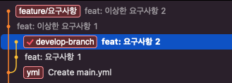
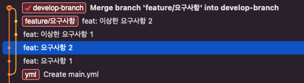
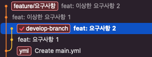
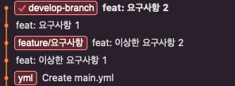
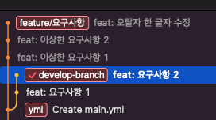
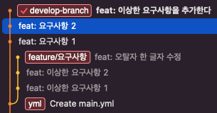
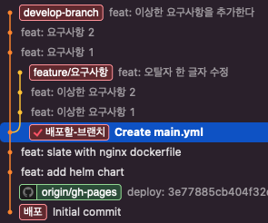
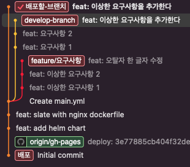

# Git
merge, rebase, cherry-pick 

made my [marp](https://github.com/marp-team/marp)

**민수**

---

# 차이가 아니라 스냅샷

### svn
각 파일의 변화를 시간순으로 관리하면서 
파일들의 집합을 관리 (델타 기반의 버전 관리 시스템)


*시간순으로 프로젝트의 스냅샷을 저장*

---

# 거의 모든 명령을 로컬에서 실행

### Git
거의 모든 명령이 로컬 파일과 데이터만 사용 (네트워크에 있는 다른 컴퓨터가 필요 없음)
프로젝트의 히스토리를 조회 할 때 서버 없이 조회
오프라인에서 커밋이 가능 ~~굳이 하고싶진 않지만요~~

---

# Git은 데이터를 추가할 뿐

Git으로 무얼 하든
Git 데이터베이스에 데이터 **추가**

commit 하지 않으면 변경사항을 잃어버릴 수 있음
commit 이후 데이터를 잃어버리기가 어려움

---

# 세 가지 상태

### Committed
데이터가 로컬 데이터베이스에 
안전하게 저장
### Modified
수정한 파일을 아직 로컬 데이터베이스에 commit하지 않음
### Staged
현재 수정한 파일을 곧 
commit할 것이라고 표시


---

# Merge


> Merge 전 후

**장점**
merge가 발생한 방법, 시기에 대한 전체 기록을 이해
실수를 발견하고 해결하는 것이 쉬움

---

# Merge


> 여러 분기에서 merge된 repository

**단점**
로그/이력이 발생
사용자 친화적이지 않음

---

# Merge


```sh
git merge feature/요구사항
```


---

# Rebase


> Rebase 전 후

**장점**
그래프가 선형
프로젝트를 진행하기 편함

**단점**
commit이 merge된 시기와 방법을 추적 할 수 없음

---

# Rebase


```
git rebase feature/요구사항
```


---

# Squash


> C4, 5, 6 -> C7로 squash

**장점**
그래프가 선형 (rebase와 같음)

단점
commit 메시지 손실이 있을 수 있음
revert가 어려울 수 있음

---

# Squash


```
git merge --squash feature/요구사항
git commit -m "feat: 이상한 요구사항을 추가한다"
```


---

# Cherry-pick


> 하나의 commit만 main branch로 merge

일부 commit만 가져올 수 있음


---

# Cherry-pick


```
git cherry-pick 29d9be3
```



---

# Git - GUI Clients
https://git-scm.com/downloads/guis
  

# 참고자료

https://git-scm.com/book/ko/v2
https://www.sascha-just.com/scig/
https://www.edureka.co/blog/git-rebase-vs-merge/
https://towardsdatascience.com/mastering-git-git-cherry-pick-fbeb23eea04d
